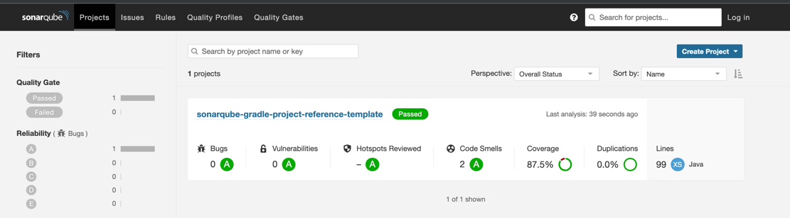
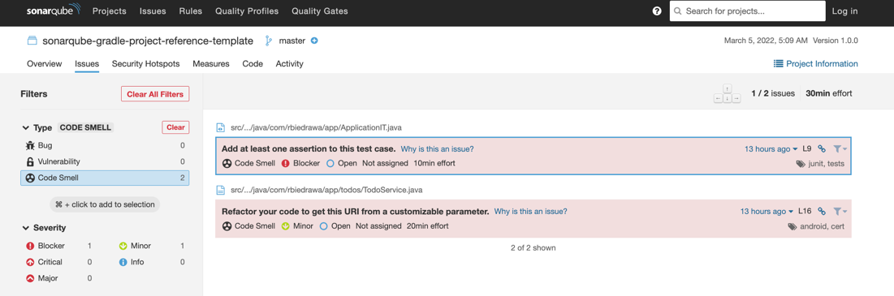

# Continuous inspection of code quality with SonarQube - Java / Gradle / Docker project reference template

This repository demonstrates how to perform and configure continuous inspection of code quality with SonarQube for Java / Gradle projects.

## Features

* Local SonarQube server via docker compose
* Gradle SonarQube plugin configuration with custom coverage/issues exclusions 
* Jacoco coverage reports 
* Separated unit and integration tests.
* Spring Boot integration tests with WireMock
* Unit testing REST services clients via @RestClientTest

## Getting Started

### Prerequisites:

* Java 11
* Docker

### Usage:

1. Start local SonarQube server
    ```shell
    docker-compose -f ./docker/sonar.yml up -d
    ```
2. Check if container is running, open SonarQube dashboard, which should be available on [http://localhost:9000/](http://localhost:9000/)
3. Run a SonarQube analysis
    ```shell
    ./gradlew clean sonarqube
    ```
4. Once the analysis completes, it should be available on the Sonar dashboard. 
   
5. Check the code smells. 
   
6. Have a fun and play with the demo setup by fixing the code smells, adding more tests for better coverages or edit [sonar-project.properties](./sonar-project.properties) to tweak the analysis

## Additional Useful Tools

* [Sonarlint - Intellij IDEA plugin](https://www.sonarlint.org/intellij)

## References

For further reference, please consider the following sections:

* [SonarQube - Code Quality and Code Security](https://www.sonarqube.org/)
* [Wiremock](https://wiremock.org/)

## License

Distributed under the MIT License. See `LICENSE` for more information.